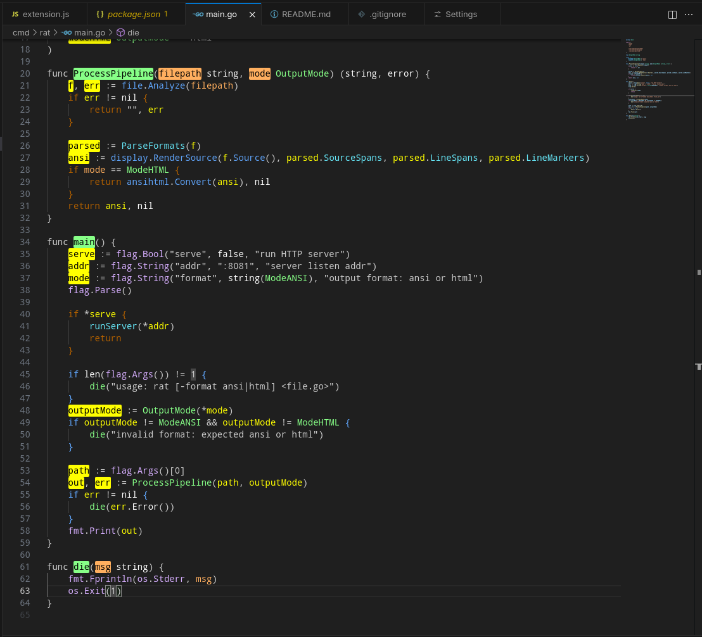
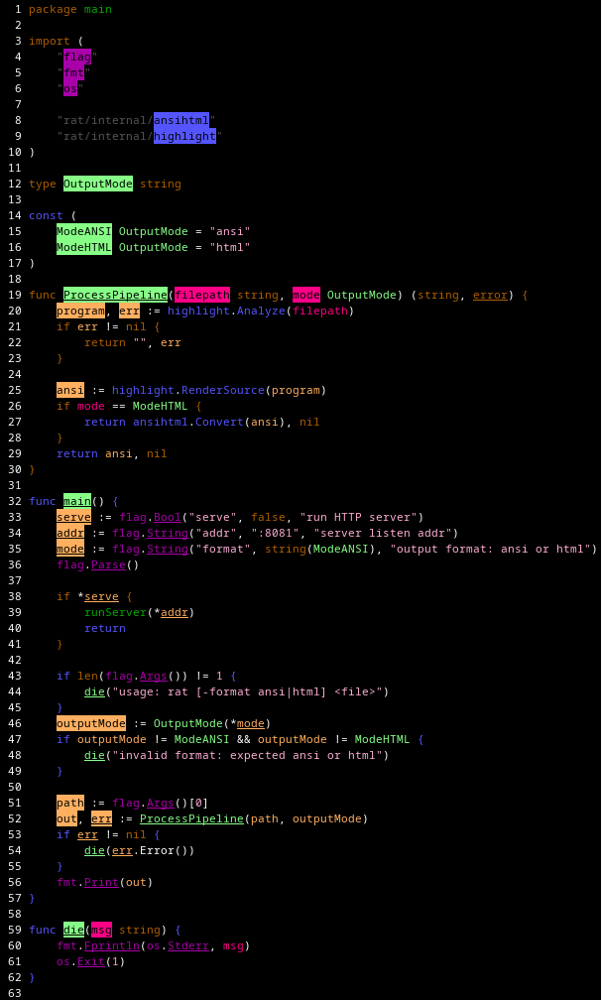

# rat

You've seen `cat`, you've seen `bat`, but have you seen `rat`?

`rat` is an experimental semantic highlighter for Go. It focuses on the semantic contour of your program. It colors names by where their declarations live, it colors blocks (functions, conditional branches, switch blocks, loops) based on their context. It works as a CLI to color print the Go file and it also works as a VS Code extension.

You can run it as a VS Code plugin.



You can also run it as a CLI on a file:

```bash
rat main.go
```



Dislaimer: I vibe coded most of this (including the README). Dev-tools can afford to be probably right as long as they help more than they hurt and the developer is aware. I'm focused more on the ergonomics of this tool rather than the correctness at the moment. If you find any errors, please let me know.

## Motivation


Syntax highlighting is useful, but it mostly repeats information you can already see. A keyword is visibly a keyword. An identifier is visibly an identifier.

The harder questions are usually semantic:

- Is this name local to the function, the file, or coming from somewhere else?
- Is this package from this repository or an external dependency?
- Is this branch a guard clause or does execution continue after it?
- Is this call statically obvious or is it going through an interface/function value?

`rat` tries to put that information directly on the page.

## Semantic Highlighting Behavior

`rat` colors Go code by what each token means, not just by what kind of token it is. It asks questions like:

- Where was this name declared?
- Is this value local, project-level, or external?
- Can this branch, loop, or switch change how execution exits?
- Is this call direct, or does the target depend on runtime dispatch?

The CLI, HTML output, HTTP API, and VS Code extension all use the same span engine, so they should show the same highlighting decisions.

Go highlighting uses Go AST/type information plus `gopls` where needed.

### Relationship Colors

Most identifier colors show how far the reference is from its declaration.

- Vibrant orange: declaration and use are inside the same function.
- Hot magenta: parameters and type parameters.
- Light green: declaration and use are in the same file, but not the same function.
- Green: declaration and use are in different files in the same package directory.
- Blue: declaration and use are in different packages under the same project root.
- Purple: external dependency, unresolved declaration, or unknown target.
- Muted orange: Go built-in declarations from `builtin`.

The project root is the nearest parent directory containing `.git` or `go.mod`. Same-package means the files are in the same directory. Same-project means both files are under the same project root but in different package directories.

### Declarations

Declarations use an inverted/background style so definitions stand out from uses.

- Top-level declarations use the same-file declaration style.
- Top-level function declarations also use the same-file declaration style.
- Declarations nested under top-level type declarations, such as struct fields and interface methods, use the same-file declaration style.
- Local variable declarations inside functions use the same-function declaration style.
- Parameters and type parameters use the parameter declaration style.
- Other declarations fall back to their kind style: type, variable, parameter, function, package, or file.

References to locally declared functions are treated as same-function or same-file references according to their declaration relationship, not as a separate function color.


### Reference-Like Types

Names are underlined when their type behaves like a reference.

- Reference-like types include pointers, slices, maps, channels, interfaces, function values, arrays containing reference-like elements, named or alias types whose underlying type is reference-like, and structs containing any reference-like field.
- The underline applies to declarations, references, and named struct fields when the resolved type is reference-like.
- Built-in mutable type constructors such as `[]`, `map`, and `chan` are also underlined.

### Imports And Packages

Import names use inverted package colors.

- Imports that resolve to files under the current project root are blue/inverted.
- Imports that resolve outside the project root, including standard-library and third-party packages, are purple/inverted.
- Import path strings are gray except for the imported package-name segment inside the string, which keeps the package relationship color.
- Selector qualifiers that name imported packages are colored with the same package relationship rules.
- Dot imports and blank imports are parsed but do not create a normal package-name reference.

### Struct Fields

Named struct fields are colored by where the field's type comes from.

- Muted orange: field type is built in.
- Light green: field type is declared in the same file.
- Green: field type is declared in the same package.
- Blue: field type is declared elsewhere in the same project.
- Purple: field type is external or unknown.

This applies to top-level struct fields, nested struct fields, inline struct literal fields, named struct literals that can be tied back to a local struct type, and typed struct literals resolved by `go/types`.

Top-level and non-inline struct field declarations are inverted. Inline struct literal field names are not inverted. If a field's type mentions multiple named types, `rat` uses the farthest relationship so a field involving an external type still looks external. For struct literals whose struct type is declared outside the current package, `rat` uses package-level resolution instead of same-file resolution to avoid noisy external-package coloring.

### Control Flow Blocks

Control-flow colors show whether a block can affect how execution leaves that block. Matching braces for recognized blocks get the same color as the block keyword.

For `if`, `else if`, and `else` branches and `case` and `default` branches:

- Muted orange: branch contains terminal control flow: `return`, `continue`, `break`, `goto`, or `panic`.
- Blue: no terminal control-flow statement was found in that branch.

For `for` and `range` loops:

- Muted orange: the loop may escape through a `break` that targets the loop or through a `return` inside the loop.
- Blue: no escaping `break` or `return` was found.
- `continue` is highlighted separately and does not make the loop itself muted orange.

For `switch`, type `switch`, and `select`:

- Green: the block has a `default` clause, so `rat` treats it as exhaustive.
- Muted orange: no `default` clause was found.

For control-flow statements:

- `return` is muted orange when it returns a non-`nil` value in a result position typed as `error`; otherwise it is blue.
- Bare `return` in a function with an `error` result is treated as returning an error.
- `break` is muted orange.
- `continue` is blue.
- `fallthrough` is blue.
- `goto` is light red.
- `panic` is light red as a statement mark. It can also make an enclosing branch terminal.

### Indirect Calls

Indirect calls are white because the concrete target is not obvious from the call site.

- Calls through function values are indirect.
- Calls through interface receivers are indirect.
- Calls through indexed call expressions are indirect.
- Direct package-qualified function calls are not treated as indirect.
- `rat` uses `go/types` first, then falls back to `gopls` definition and hover data when static information is incomplete.

### Lexical Tokens

`rat` also colors a few plain lexical tokens so the semantic colors have enough context.

- Comments are gray, including multi-line comment spans.
- Literal tokens, including strings outside import specs, numbers, chars, floats, and imaginary literals, are light pink.
- `type`, `struct`, `interface`, `var`, `package`, and `import` are muted orange. Mutable type constructors such as `[]`, `map`, and `chan` are muted orange and underlined.
- The package name following a `package` keyword is green.
- `defer`, `go`, and `const` are blue.
- `goto` is light red.
- `func` and matching function body braces are muted orange when the function signature ends in `error`; otherwise they are blue. Inline function literals also mark their closing indentation with an inverted white span.
- `range` inherits the color of its enclosing `for` loop when `rat` has a loop mark for it.
- Import path strings are gray outside the imported package-name segment.

### Span Priority And Output

When multiple spans could apply to the same text, `rat` keeps one. Spans are sorted by start column, then by priority, then by end column. The first accepted span wins, and later overlapping spans are skipped. Same-function references and control-flow marks use higher priority than ordinary spans.

When a resolved location does not exactly match the token text in the source line, `rat` searches for the closest occurrence of that text on the line. Unhighlighted text stays white in terminal output. In VS Code, only spans returned by `rat` are decorated, so editor syntax colors do not cover `rat` span colors.

## Requirements

- Go 1.26 or newer, matching this repo's `go.mod`.
- Node.js and npm if you want to build the VS Code extension package.
- VS Code if you want editor decorations.

## Install The CLI And VS Code Extension

Make sure `$HOME/bin` exists and is on your `PATH`:

```bash
mkdir -p "$HOME/bin"
export PATH="$HOME/bin:$PATH"
```

Install the VS Code extension dependencies once:

```bash
cd vscode-text-semantic
npm install
cd ..
```

Build everything:

```bash
make
```

`make` does three things:

1. Builds `internal/file/scan/golang/goplsclient/gopls` so it can be embedded.
2. Builds `rat` in the repository root.
3. Builds the VS Code `.vsix` package and moves it to the repository root.

Install the CLI and generated extension package:

```bash
make install
```

Install the generated extension package:

```bash
code --install-extension text-semantic-highlight-*.vsix
```

You can also install it from VS Code by right-clicking the generated `.vsix` file and choosing `Install Extension VSIX`.

## CLI Usage

Print ANSI-colored output:

```bash
rat path/to/file.go
```

Generate HTML:

```bash
rat -format html path/to/file.go
```

Run the local HTTP server used by the VS Code extension:

```bash
rat --serve --addr :8081
```

The server accepts `POST /spans`:

```json
{ "path": "/absolute/path/to/file.go" }
```

The path may point to a supported Go source file.

It returns flattened JSON spans grouped by 1-based line number:

```json
{
  "spans": {
    "7": [
      { "start": 5, "end": 10, "style": "\u001b[38;5;226m" }
    ]
  }
}
```

## VS Code Usage

After installing the extension, open a Go workspace and open or save a Go file.

By default, the extension starts:

```bash
rat --serve --addr :8081
```

Then it calls `http://localhost:8081/spans` for visible Go files and turns the returned ANSI styles into VS Code decorations.

The extension keeps decoration state per document, refreshes visible editors on active-editor changes, saves, and relevant configuration changes, and normalizes both grouped and legacy flat span payloads for tests and local development.

Useful settings:

- `textSemanticHighlight.enabled`: turn highlighting on or off.
- `textSemanticHighlight.serverUrl`: server URL, default `http://localhost:8081`.
- `textSemanticHighlight.languages`: language IDs to decorate, default `go`.
- `textSemanticHighlight.autoStartServer`: whether the extension starts the server.
- `textSemanticHighlight.serverCommand`: command to start the server, default `rat`.
- `textSemanticHighlight.serverArgs`: server arguments, default `--serve --addr :8081`.
- `textSemanticHighlight.serverCwd`: working directory for the server.

Command palette command:

```text
Text Semantic Highlight: Toggle
```

For extension development from this repository, you can set:

```json
{
  "textSemanticHighlight.serverCommand": "go",
  "textSemanticHighlight.serverArgs": ["run", "./cmd/rat", "--serve", "--addr", ":8081"],
  "textSemanticHighlight.serverCwd": "${workspaceFolder}"
}
```

## Troubleshooting

If VS Code shows no colors:

- Confirm `rat` is on your `PATH`: `rat --serve --addr :8081` should start a server.
- Check the VS Code output channel named `Text Semantic Highlight`.
- Save the file. The extension refreshes on active editor changes and saves.
- Make sure the file is in a Go module/workspace that Go tooling can load.
- Make sure port `8081` is not already used by another process.

If `rat` cannot find or run `gopls`:

- Rebuild with `make` so `gopls` is embedded before `rat` is compiled.
- Or set `GOPLS_BIN=/path/to/gopls` to force a specific `gopls` binary.

If a color seems wrong:

- `rat` is conservative and experimental; some cross-package or dynamic cases depend on what `gopls` can resolve.
- Interface calls and function-value calls are intentionally marked as indirect.
- Declaration backgrounds are intentional so definitions are easy to spot.

## Development Commands

Run tests:

```bash
go test ./...
```

Run the VS Code extension parity tests:

```bash
cd vscode-text-semantic
npm test
```

Build the embedded `gopls` artifact:

```bash
go build -o internal/file/scan/golang/goplsclient/gopls golang.org/x/tools/gopls
```

Build just the CLI in the repo root:

```bash
go build ./cmd/rat
```

Build just the VS Code extension:

```bash
cd vscode-text-semantic
npm run build
```

Regenerate the CLI screenshot:

```bash
make .images/cli.png
```

## Known Limitations And Next Steps

This is experimental and Go-specific today.

Future directions could include improving dynamic call detection and making sticky-scroll/editor integrations behave better with decorations.

Contributions are welcome. Please keep changes understandable and avoid adding complexity that is not buying better signal in the editor.
